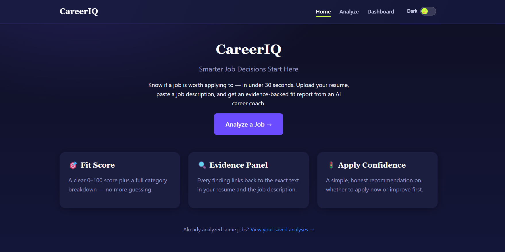
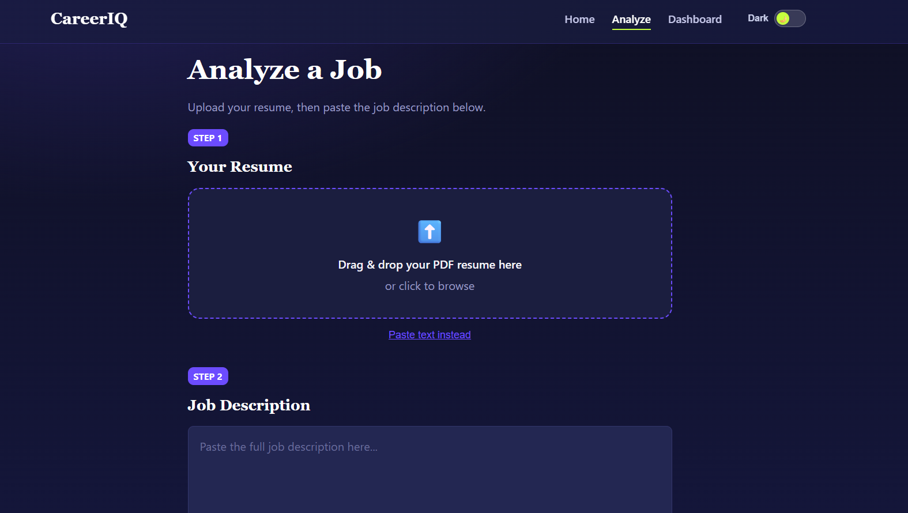
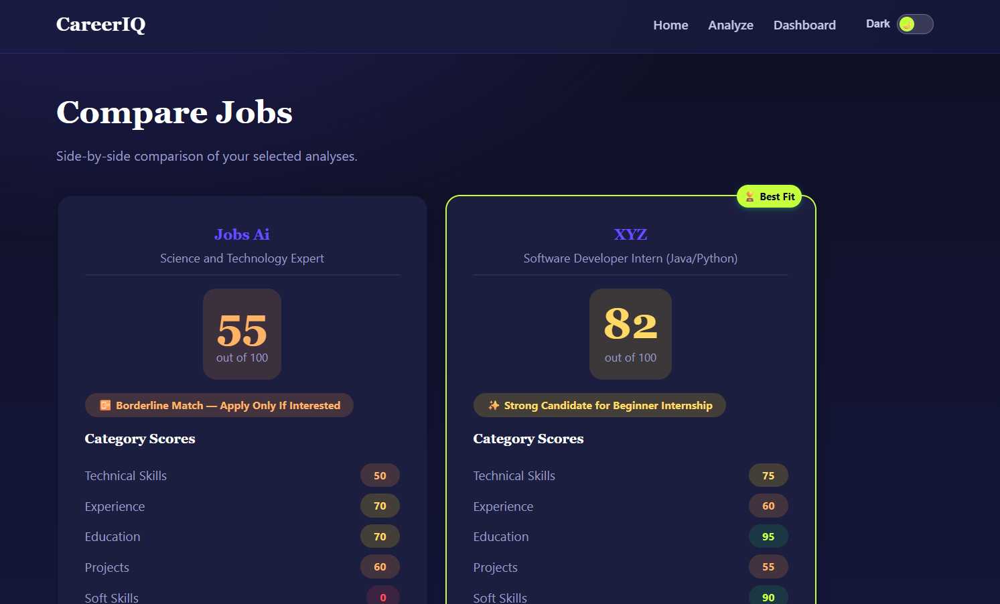
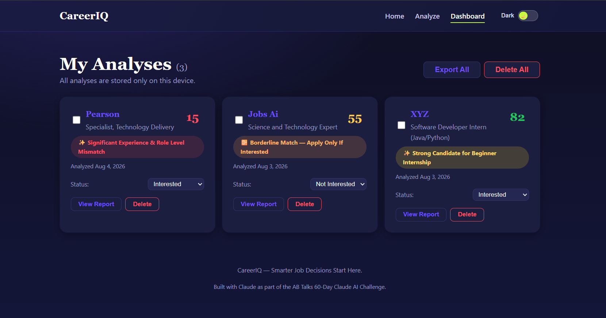

# CareerIQ
### Smarter Job Decisions Start Here

**Live demo:** [https://ananyasingla529-bit.github.io/CareerIQ/](https://ananyasingla529-bit.github.io/CareerIQ/)
**Version:** v1.0.0
**Built by:** [Ananya Singla](https://github.com/ananyasingla529-bit) — as part of the AB Talks 60-Day Claude AI Challenge



---

## What is CareerIQ?

CareerIQ is an AI-powered career decision-support tool that answers one question fast: **is this job actually worth applying to?**

Instead of manually cross-referencing your resume against a job description, upload your resume (PDF or text) and paste a job posting — CareerIQ gives you a structured, evidence-backed fit report in under 30 seconds: an overall score, a category breakdown, exactly which requirements you match or miss (with the supporting text quoted), eligibility red flags, and a clear recommendation on what to do next.

It's built to feel like a career coach, not a keyword scanner — and it never leaves you without an answer, even without an internet connection.

---

## Key Features

- **🎯 Fit Score & Category Breakdown** — overall 0–100 score plus 7-category analysis (technical skills, experience, education, projects, soft skills, eligibility, keywords)
- **🔍 Evidence Panel** — every finding links back to the exact text in your resume and the job description
- **🧠 AI Reasoning Panel** — see *why* the AI reached each conclusion, with a confidence level
- **🌟 "Why You're Still a Good Fit"** — highlights transferable skills and strengths, even on a lower score
- **🚦 Apply Confidence Meter** — a clear, honest recommendation: Apply Now / Improve First / Borderline / Upskill First
- **✍️ Resume Rewrite Assistant** — AI-suggested, resume-ready phrasing for skills you likely already have but aren't clearly reflected — grounded only in evidence actually present in your resume, never fabricated
- **📴 Offline-Resilient** — if the AI service is unavailable, an automatic rule-based fallback engine still produces a full, useful report — the core analysis never breaks
- **💾 Save & Track** — save analyses locally, track application status (Interested / Applied / Not Applied / Not Interested)
- **⚖️ Compare Jobs** — select 2–3 saved analyses and compare them side by side to decide which to prioritize
- **🌓 Light & Dark Themes** — toggle between a bold Electric Indigo/Neon Lime dark theme and a clean navy/cyan light theme, with your preference remembered
- **🔒 Privacy-First** — all your data stays in your browser's local storage; nothing is uploaded to a server except the text sent for AI analysis

<table>
<tr>
<td></td>
<td></td>
</tr>
<tr>
<td align="center"><em>Upload a resume, paste a JD, get a full fit report</em></td>
<td align="center"><em>Compare saved analyses side by side</em></td>
</tr>
</table>



---

## How It Works (Architecture)

```
Browser (static site, GitHub Pages)
  │
  ├─ PDF.js — client-side resume text extraction
  ├─ analysisController.js — tries AI first, automatically falls back to offline
  │     ├─ aiEngine.js ──HTTPS──▶ Cloudflare Worker (hides API key) ──▶ Gemini API
  │     └─ offlineEngine.js — deterministic rule-based analysis (always works)
  ├─ report.js — renders the same JSON report shape from either engine
  └─ storage.js — all saved data lives in localStorage, never leaves your device
```

The AI and offline engines both produce the exact same structured report shape, so the UI never needs to know which one ran — this is what makes the "always get an answer" reliability promise possible. The Resume Rewrite Assistant is the one feature that requires live AI (creative, grounded phrasing can't be meaningfully faked offline), and it fails honestly rather than pretending when AI is unavailable. Full technical detail is in [`docs/ARCHITECTURE.md`](docs/ARCHITECTURE.md).

---

## Tech Stack

| Layer | Choice |
|---|---|
| Frontend | Vanilla HTML / CSS / JavaScript — no framework, no build tools |
| AI | Google Gemini API (`gemini-flash-latest`), via a Cloudflare Worker proxy |
| Resume parsing | PDF.js |
| Storage | Browser `localStorage` |
| Hosting | GitHub Pages |
| Proxy | Cloudflare Workers (free tier) |

Every tool used is free — no paid API keys or subscriptions required to run or fork this project.

---

## Getting Started Locally

```bash
git clone https://github.com/ananyasingla529-bit/CareerIQ.git
cd CareerIQ
```

Open `index.html` with a local dev server (e.g., the VS Code **Live Server** extension — right-click `index.html` → "Open with Live Server"). No `npm install`, no build step required.

**Note:** the AI analysis and Resume Rewrite Assistant features call a Cloudflare Worker proxy that isn't included in this repo's deployment by default. To use your own Gemini key, deploy `proxy/cloudflare-worker.js` to your own Cloudflare Workers account (free), set a `GEMINI_API_KEY` secret, and update the `AI_PROXY_URL` constant in `js/aiEngine.js`. Without this, the app still works fully — every analysis just uses the offline engine instead, and the Rewrite Assistant will explain that it needs an AI connection.

Full setup detail: [`docs/SETUP.md`](docs/SETUP.md).

---

## Project Structure

```
careeriq/
├── index.html, analyze.html, dashboard.html, compare.html, 404.html
├── css/styles.css          # Full design system (light + dark theme, single stylesheet)
├── js/                     # All application logic, one file per responsibility
├── data/skillsTaxonomy.js  # Skill dictionary used by the offline engine
├── proxy/cloudflare-worker.js
├── assets/                 # Icons, screenshots
└── docs/                   # PRD, architecture, schema, API docs, blueprint, progress log
```

Full breakdown: [`docs/PROJECT-STRUCTURE.md`](docs/PROJECT-STRUCTURE.md).

---

## Roadmap (v2)

CareerIQ v1.0 is a deliberately scoped MVP. Features intentionally deferred:

- Live job board integration (auto-pull listings)
- Full analytics dashboard (trends, most common missing skills)
- Favorites, search, and filter across saved analyses
- Full application pipeline tracking (6-stage)
- Analysis version history
- Full hybrid AI + rule-engine merge (currently AI-first with rule-based fallback)

See [`docs/CareerIQ_Implementation_Blueprint.md`](docs/CareerIQ_Implementation_Blueprint.md) for the complete v1.0 vs. v2 scope breakdown, and [`future-scope.md`](future-scope.md) for the 3/6/12-month product vision.

---

## Documentation

This project was built with a full documentation trail across a 10-day structured build — useful for anyone reviewing the engineering process:

- [Product Requirements Document](docs/CareerIQ_PRD.docx)
- [Architecture](docs/ARCHITECTURE.md)
- [Data Schema](docs/SCHEMA.md)
- [API Design](docs/API.md)
- [Implementation Blueprint](docs/CareerIQ_Implementation_Blueprint.md)
- [Daily Progress Log](PROGRESS.md)
- [Challenge Retrospective](challenge-retrospective.md)
- [30-Day Growth Plan](30-day-growth-plan.md)

---

## License

MIT — see [LICENSE](LICENSE).

---

## Acknowledgments

Built as part of the **AB Talks 60-Day Claude AI Challenge**, using Claude (Anthropic, free tier) throughout the design, architecture, and implementation process as an AI pair programmer.
