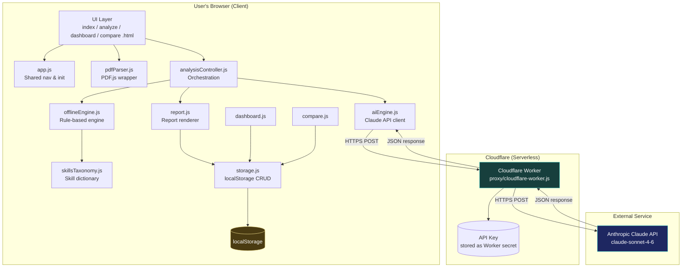
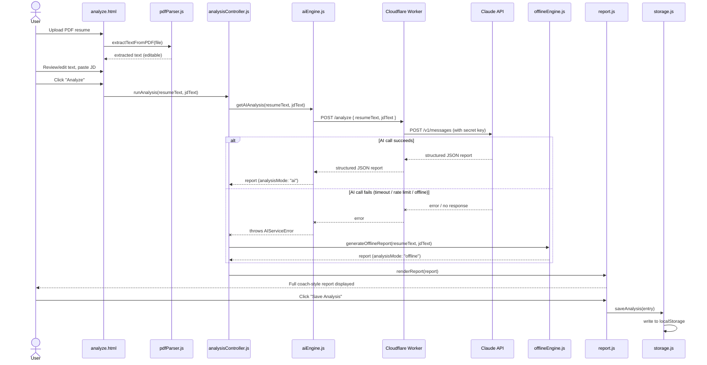
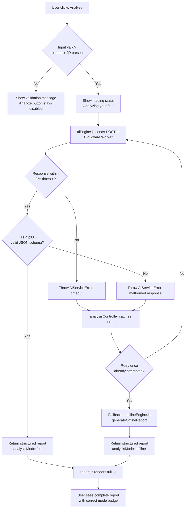

# CareerIQ — System Architecture
**Day 2 Deliverable — Source of truth for all technical structure decisions**

---

## 1. Architecture Overview

CareerIQ is a **static, client-heavy web application** with exactly one server-side component: a serverless proxy that hides the Claude API key. Everything else — UI rendering, PDF parsing, offline analysis, data storage, comparison logic — runs entirely in the user's browser. This directly satisfies the PRD's offline-first and privacy-by-design principles: the app shell never depends on a live backend to function.

**Architecture style:** Static frontend + single serverless function (Backend-for-Frontend pattern, minimal).

---

## 2. Component Diagram

**Key architectural decision — why the proxy exists:** GitHub Pages serves static files only; any API key embedded in client JS would be publicly visible in the page source. The Cloudflare Worker is the *only* place the Anthropic API key ever exists, stored as an encrypted Worker secret, never in a repository file.

---

## 3. Data Flow — Primary Analysis Journey

---

## 4. Request Lifecycle — AI Analysis Call

---

## 5. AI Interaction Design

**Prompt strategy:** `aiEngine.js` sends the raw resume text and JD text to the Worker along with a system instruction telling Claude to act as an expert career coach and return **only** valid JSON matching the locked schema (see `SCHEMA.md`) — no markdown fences, no preamble text.

**Reliability layer around the AI call:**
- 25-second client-side timeout
- One automatic retry on network/timeout failure
- Strict JSON-shape validation on the client before accepting the response as valid
- Any failure at any of these stages triggers the offline fallback automatically — the user never sees a raw error

**Why this satisfies "Transparent AI" (PRD architecture principle):** the same prompt explicitly requires a `reasoning[]` array (explanation + confidence per conclusion) and evidence pointers back into the source text, so the AI's output is inherently structured for the Reasoning Panel and Evidence Panel — no separate "explain yourself" call is needed.

---

## 6. External Services

| Service | Purpose | Cost | Failure Handling |
|---|---|---|---|
| **Anthropic Claude API** | Primary analysis reasoning engine | Free tier / pay-as-you-go (routed through your own Anthropic account) | Automatic offline fallback (see §4) |
| **Cloudflare Workers** | Serverless proxy hiding the API key | Free tier (100k req/day) | If Worker itself is unreachable, same fallback path triggers |
| **GitHub Pages** | Static site hosting | Free | N/A — this *is* the app; no external dependency once loaded |
| **PDF.js (CDN)** | Client-side PDF parsing | Free, no key required | Parse failure → graceful UI fallback to plain-text paste (no dependency on this service for offline mode) |
| **Chart.js (CDN)** | Category breakdown visualization | Free, no key required | If CDN fails to load, category data still displays as plain text/numbers (progressive enhancement) |

---

## 7. Modularity & Future Extensibility

The architecture is deliberately layered so v2 features (PRD §5.2) can be added without touching unrelated modules:

- **New AI provider?** Only `aiEngine.js` changes — `analysisController.js`'s contract (`report JSON in, same shape out`) stays identical.
- **Cloud sync?** Only `storage.js` changes internally (swap `localStorage` calls for API calls) — every module that calls `storage.js` (`report.js`, `dashboard.js`, `compare.js`) is unaffected.
- **New analysis modules (e.g., rule+AI hybrid merge)?** Slot into `analysisController.js` as a third path alongside AI/offline, without altering `report.js`'s rendering contract.
- **Backend migration (Netlify/Vercel)?** Only the Worker/proxy layer and hosting config change — the entire client-side app is host-agnostic static files.

This is the concrete implementation of the PRD's "Modular & Scalable Architecture" and "Future-Ready Roadmap" requirements.
