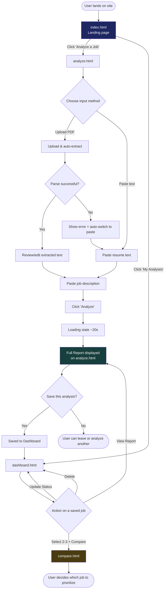
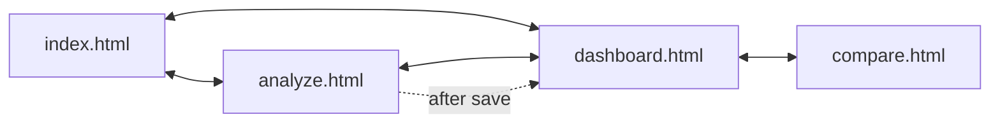

# CareerIQ — UI & User Flow
**Day 2 Deliverable — Low-fidelity wireframes and navigation design**

---

## 1. User Flow Diagram



---

## 2. Screen Flow & Navigation

**Global navigation (present on all 4 pages):** `CareerIQ` logo (→ home) | `Analyze` | `Dashboard` — a simple 3-link header, no deep menu structure needed at this scope.



Every screen exists for a distinct reason — confirmed against the PRD:
- **`index.html`** — first impression / value prop for a recruiter landing on the live link; entry point into the core flow
- **`analyze.html`** — does double duty as both the input flow *and* the report display (single continuous page, no separate "report.html" — keeps the core journey to one navigation step, reducing complexity)
- **`dashboard.html`** — return-visit value; satisfies FR-5.3
- **`compare.html`** — the one explicitly-approved additional v1.0 feature beyond the base flow; satisfies FR-5.4–5.5

No unnecessary screens exist. A separate "report.html" was considered and deliberately rejected — rendering the report inline on `analyze.html` after analysis completes avoids an extra page load and keeps the "aha moment" (PRD's flawless moment, Q17) uninterrupted.

---

## 3. Wireframes (Low-Fidelity)

### 3.1 `index.html` — Landing Page

```
┌──────────────────────────────────────────────────────────┐
│  CareerIQ                          [Analyze] [Dashboard]  │
├──────────────────────────────────────────────────────────┤
│                                                            │
│              CareerIQ                                    │
│      Smarter Job Decisions Start Here                    │
│                                                            │
│   Know if a job is worth applying to — in 30 seconds.    │
│                                                            │
│            [ Analyze a Job →  ]  (primary CTA)           │
│                                                            │
│   ┌────────┐   ┌────────┐   ┌────────┐                   │
│   │ 🎯 Fit │   │ 🔍 Evi- │   │ 🚦 Con- │   (3 feature      │
│   │ Score  │   │ dence   │   │ fidence │    highlight      │
│   │        │   │ Panel   │   │ Meter   │    cards)         │
│   └────────┘   └────────┘   └────────┘                   │
│                                                            │
└──────────────────────────────────────────────────────────┘
```

### 3.2 `analyze.html` — Input State

```
┌──────────────────────────────────────────────────────────┐
│  CareerIQ                          [Analyze] [Dashboard]  │
├──────────────────────────────────────────────────────────┤
│  Step 1: Your Resume                                      │
│  ┌────────────────────────────────────────────────────┐  │
│  │   ⬆  Drag & drop your PDF resume, or click to browse │  │
│  │        [Paste text instead]                          │  │
│  └────────────────────────────────────────────────────┘  │
│                                                            │
│  Step 2: Job Description                                  │
│  ┌────────────────────────────────────────────────────┐  │
│  │  [ textarea — paste JD here ]                        │  │
│  │                                     124 / 100 chars   │  │
│  └────────────────────────────────────────────────────┘  │
│                                                            │
│                  [   Analyze Fit  →   ]  (disabled until  │
│                                            both valid)     │
└──────────────────────────────────────────────────────────┘
```

### 3.3 `analyze.html` — After PDF Upload (Review State)

```
┌──────────────────────────────────────────────────────────┐
│  Step 1: Your Resume  ✓ Extracted from resume.pdf         │
│  ┌────────────────────────────────────────────────────┐  │
│  │  [ editable textarea, pre-filled with extracted text]│  │
│  │  Review and fix anything that looks off ↑            │  │
│  └────────────────────────────────────────────────────┘  │
└──────────────────────────────────────────────────────────┘
```

### 3.4 `analyze.html` — Report State (core "aha" screen)

```
┌──────────────────────────────────────────────────────────┐
│  ✨ AI Analysis   (mode badge)                             │
│                                                            │
│           ┌─────────────┐                                │
│           │   82 / 100   │   "Strong Fit"                │
│           └─────────────┘                                │
│                                                            │
│  🚦 Apply Confidence:  [🟢 Apply Now ─────────]           │
│  ➡  Recommended Next Action: [ 🟢 Apply Now ]             │
│                                                            │
│  Category Breakdown (bar chart)                           │
│  Technical Skills  ████████░░ 80                          │
│  Experience        ███████░░░ 70                          │
│  ... (7 total)                                            │
│                                                            │
│  ✅ Matching Strengths            ⚠ Missing / Gaps         │
│  ┌──────────────────┐            ┌──────────────────┐    │
│  │ • React (view ev.)│            │ • SQL (view ev.) │    │
│  │ • ...              │            │ • ...             │   │
│  └──────────────────┘            └──────────────────┘    │
│                                                            │
│  🚩 Eligibility Flags (if any)                             │
│                                                            │
│  🌟 Why You're Still a Good Fit                            │
│  • ... • ... • ...  (3-5 points, highlighted card)         │
│                                                            │
│  💡 Recommendations                                        │
│  • ... • ...                                               │
│                                                            │
│  ▸ AI Reasoning Panel (expandable)                         │
│                                                            │
│           [  💾 Save This Analysis  ]                     │
└──────────────────────────────────────────────────────────┘
```

### 3.5 `dashboard.html`

```
┌──────────────────────────────────────────────────────────┐
│  CareerIQ                          [Analyze] [Dashboard]  │
├──────────────────────────────────────────────────────────┤
│  My Analyses (4)          [Export All]  [Delete All]      │
│                                                            │
│  ☐ ┌──────────────────────────────────────────────────┐  │
│    │ Google — SDE Intern          Fit: 82   🟢 Apply Now│  │
│    │ Analyzed Jul 29               [Interested ▾]       │  │
│    │                    [View Report]  [Delete]         │  │
│    └──────────────────────────────────────────────────┘  │
│  ☐ ┌──────────────────────────────────────────────────┐  │
│    │ Zoho — Full Stack Intern     Fit: 55  🟠 Borderline│  │
│    │ ...                                                │  │
│    └──────────────────────────────────────────────────┘  │
│                                                            │
│               [ Compare Selected (0/3) ]  (disabled)       │
└──────────────────────────────────────────────────────────┘
```

### 3.6 `compare.html`

```
┌──────────────────────────────────────────────────────────┐
│  Comparing 3 Jobs                                          │
│  ┌────────────┬────────────┬────────────┐                │
│  │ Google  🏆  │  Zoho       │  Infosys    │  (headers)     │
│  │ Fit: 82     │  Fit: 55    │  Fit: 68    │                │
│  ├────────────┼────────────┼────────────┤                │
│  │ Tech: 85    │  Tech: 60   │  Tech: 70   │  (category     │
│  │ Exp: 75     │  Exp: 40    │  Exp: 65    │   score rows)  │
│  │ ...         │  ...        │  ...        │                │
│  ├────────────┼────────────┼────────────┤                │
│  │ Strengths   │  Strengths  │  Strengths  │                │
│  │ • React     │  • HTML     │  • Java     │                │
│  ├────────────┼────────────┼────────────┤                │
│  │ 🟢Apply Now │ 🟠Borderline│ 🟡Improve   │                │
│  └────────────┴────────────┴────────────┘                │
└──────────────────────────────────────────────────────────┘
```

---

## 4. Responsive Behavior Notes

- **Mobile (< 600px):** `analyze.html`'s report sections stack fully vertically; `compare.html`'s 3-column table becomes horizontally scrollable with a visible "swipe to compare →" affordance rather than cramming columns (decided now per Day 8's blueprint note, to avoid a last-minute decision under time pressure).
- **Tablet/Desktop (≥ 768px):** Layouts as shown above.

## 5. Design System Application (from Day 2's tech stack, applied visually)

- One primary accent color drives all CTAs and score-positive indicators; a distinct warning/danger palette for gaps and hard-eligibility blockers — consistent with the pitch deck's palette already established Day 1.
- Every score/tier uses consistent color coding app-wide: 🟢 green (80–100), 🟡 yellow (60–79), 🟠 orange (40–59), 🔴 red (<40) — same mapping in the report, dashboard cards, and comparison view, so users learn it once.
